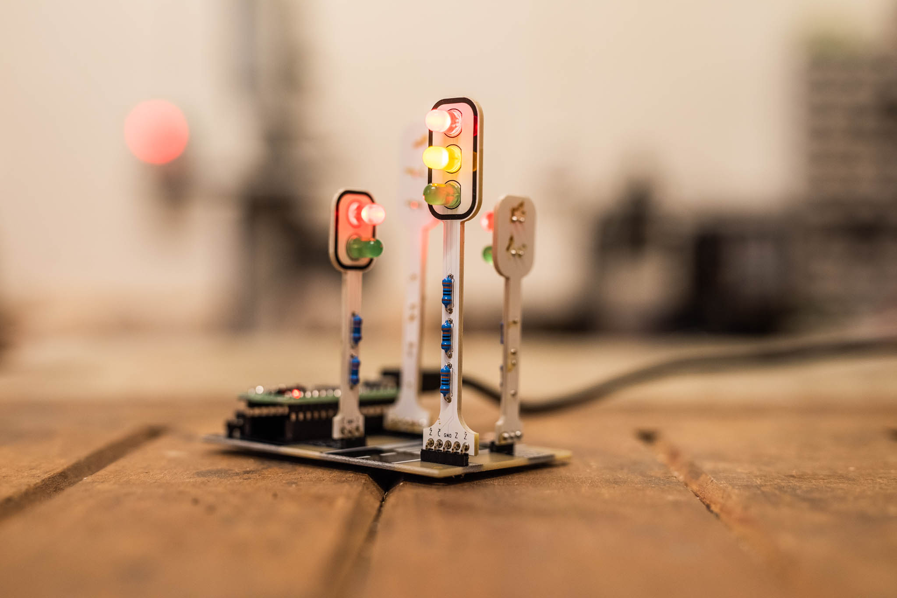

# Traffic Lights

Kit of crossing for walkers controlled by traffic lights. Button BTN1 gives signal for walker, button BTN3 turns off the crossroad.

* [Tutorial for building](doc/manual-cz.md) ([PDF](doc/manual-cz.pdf))
* [Upload of new firmware](doc/firmware-cz.md)
