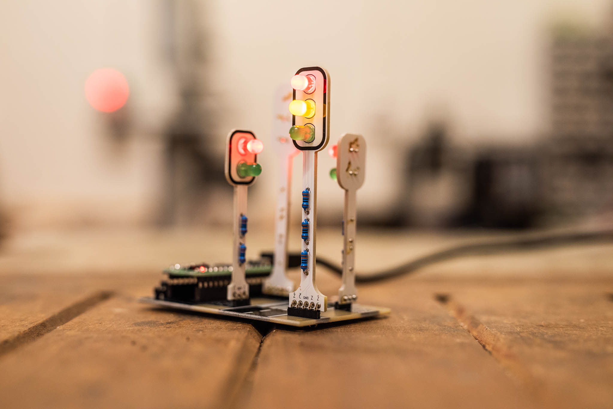

# Traffic Lights / Semafory

## Česky

Stavebnice přechodu pro chodce řízeného semafory. Tlačítko BTN1 dává signál pro chodce, tlačítko BTN3 vypne křižovatku.

* [Návod na stavbu](doc/manual-cz.md) ([PDF](doc/manual-cz.pdf))
* [Nahrání nového firmware](doc/firmware-cz.md)

## English

Coming coon...
